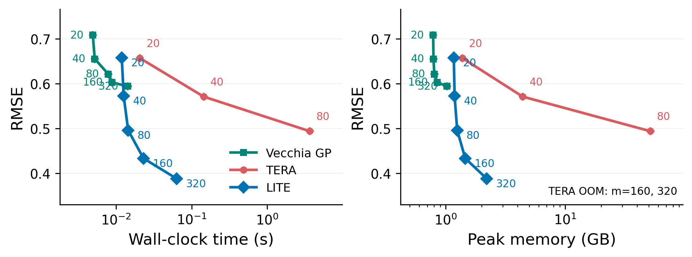
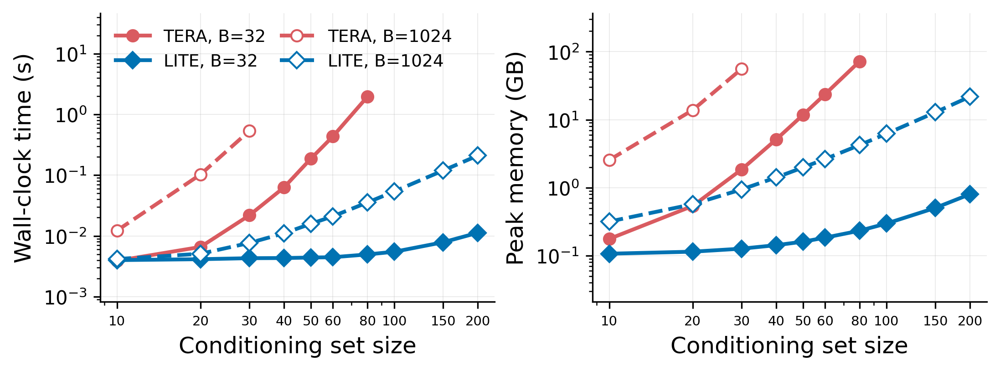
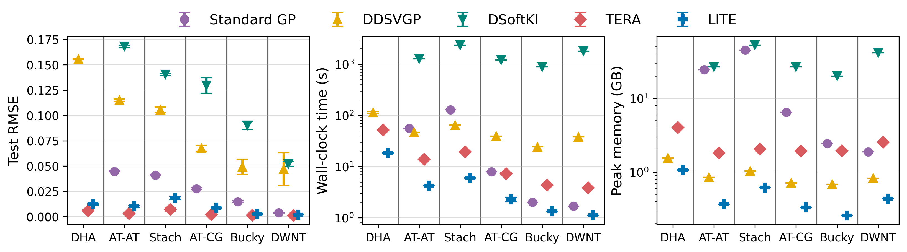
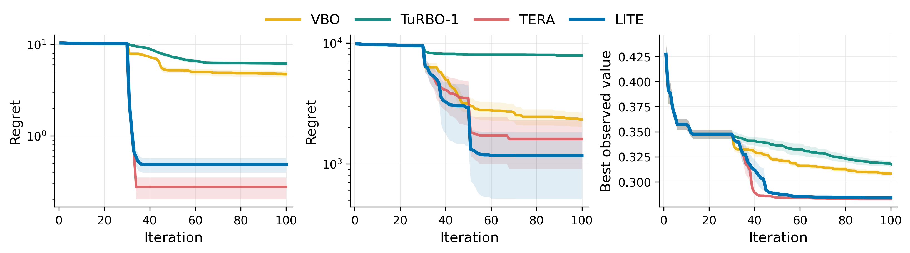

# Derivative Gaussian Processes on a Two-Direction Budget

This repository provides the implementation of **LITE**, a scalable derivative Gaussian process method for
scalar function-value prediction with observed gradients. For each target and its Vecchia conditioning set,
LITE retains at most two directional derivatives per observed gradient.
This reduces the dense factorization cost to **O(m³)** and covariance storage to **O(m²)** per target, where
`m` is the conditioning set size, enabling larger conditioning sets and batched training and prediction.
The code includes experiments for:

- Prediction accuracy and computational scaling as conditioning set and batch sizes increase.
- Large-scale GP regression with observed gradients on the MD22 benchmark.
- High-dimensional Bayesian optimization on synthetic objectives and the LassoDNA task.

---

## Main Results

<!-- Place the paper's Figures 3, 4, and 5 in figures/ using the filenames below. -->

### Scaling to Larger Conditioning Sets and Batch Sizes




**Figure 1:** Prediction accuracy and computational scaling. Top panels show analytically evaluated RMSE under
the assumed GP against total prediction time and peak GPU memory, with `n = 100,000`, `d = 500`, and 256
prediction targets. Bottom panels show the time and peak GPU memory of one training step on the MD22
Buckyball-catcher dataset. Both methods use batched implementations. Prediction uses batch size 32;
training-step comparisons use batch sizes 32 and 1,024.

In the GP prediction experiment, LITE matches TERA's accuracy at equal conditioning set size.
At `m = 320`, LITE achieves lower RMSE than TERA at `m = 80` while
running **58× faster** and using **4.3% of its memory**. TERA runs out of GPU memory for `m ≥ 160`
at the tested batch size.

### Large-Scale GP Regression



**Figure 2:** Scalar energy prediction on six MD22 molecular datasets using observed forces as gradient
information. Panels show test RMSE per atom in physical units, end-to-end wall-clock time, and peak GPU memory.
All methods use isotropic SE kernels and identical train/test splits. LITE and TERA use `m = 30` and training/prediction batches of 32.

LITE achieves lower RMSE than DDSVGP, DSoftKI, and the function-only Standard GP, with the lowest runtime
and peak GPU memory on every benchmark. Compared with TERA, it runs **2.8–3.5× faster** and uses
**13.3–30.2% of its memory**, while its RMSE is higher. This comparison illustrates the accuracy-cost tradeoff
of retaining two directions per gradient.

### High-Dimensional Bayesian Optimization



**Figure 3:** Simple regret on Ackley-500D and Levy-800D, and the best observed objective value on LassoDNA-180D,
versus iteration. LITE and TERA use objective values and gradients, while VBO and TuRBO-1 use objective values only.

LITE outperforms the function-only baselines on all three tasks. It achieves final objective values comparable to TERA
while retaining only two directional derivatives per obseved gradient.
---

## Installation

Use Python 3.10 or newer. A CUDA-enabled PyTorch installation is recommended for the main experiments.
Run the following commands from the repository root:

```bash
python -m venv .venv
source .venv/bin/activate
python -m pip install -e .
```

---

## Experiments

The following entry points and configs cover the main experiments and additional diagnostics.
Configs and CLI overrides jointly specify the experiment settings; run a script with `--help` to list its options.

| Experiment            | Run script | Config |
|:----------------------|:---|:---|
| GP simulation         | `scripts/run_gp_sim_subprocess.py` | `configs/gp_sim/matern52_expected_mse_m_sweep.yaml` |
| MD22 `m` scaling      | `scripts/run_md22_step_scaling.py` | `configs/md22/main.yaml` |
| GP regression on MD22 | `scripts/run_md22.py` | `configs/md22/main.yaml` |
| BO - Synthetic        | `scripts/run_bo.py` | `configs/bo/main.yaml` |
| BO - LassoDNA         | `scripts/run_bo.py` | `configs/bo/lassodna.yaml` |

## How to Run

Run the following commands from the repository root.

### MD22 regression

Place the MD22 dataset files in `data/md22`, or specify their location with `--data-dir`.

```bash
python -u scripts/run_md22.py \
  --config configs/md22/main.yaml \
  --data-dir data/md22 \
  --outdir outputs/md22_local \
  --methods lite,tera_batched --m 30 \
  --train-epochs 1 --train-batch-size 32 --prediction-batch-size 32 \
  --seeds 7,23,42,71,99 \
  --device cuda --dtype float64
```

#### Bayesian optimization

Run LITE, batched TERA, VBO, and TuRBO-LogEI on Ackley-500D and Levy-800D.

```bash
python -u scripts/run_bo.py \
  --config configs/bo/main.yaml \
  --outdir outputs/bo_synthetic \
  --benchmarks ackley_500,levy_800 \
  --methods lite,tera_batched,vbo,turbo-logei \
  --seeds 1,27,42,86,99 \
  --budget 100 --n-init 30 --query-batch-size 1 \
  --m 30 --train-batch-size 256 --prediction-batch-size 256 \
  --tera-train-batch-size 32 --tera-prediction-batch-size 32 \
  --device cuda --dtype float64 --verbose
```

Method-specific flags override common options. VBO and TuRBO use their own
configured training settings. Use `--help` to list all available options.

---

## Citation

<!-- Add author names and the arXiv identifier when the public preprint is available. -->

```bibtex
@misc{seung2026twodirection,
  title = {Derivative Gaussian Processes on a Two-Direction Budget},
  year  = {2026},
}
```
